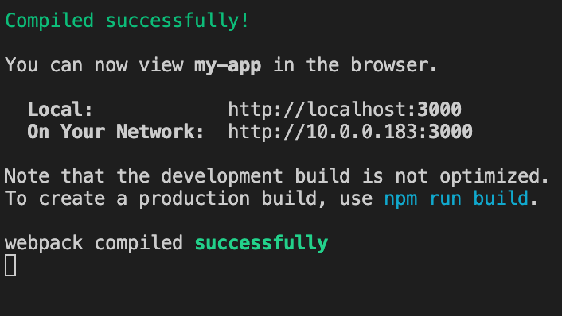
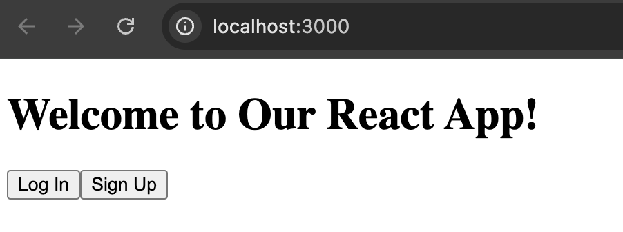
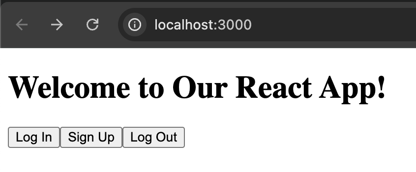
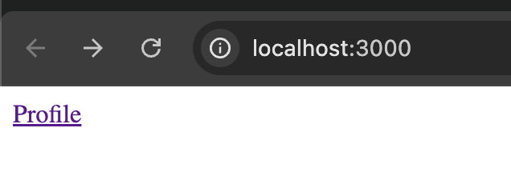

# Lab 10 - Authentication
# Activity 0 - Installing Auth0 React SDK & obtaining the domain and clientId

### Instructions
0. To use Auth0 in your React project, you need to install the `@auth0/auth0-react` package. Run the following command:
`npm install @auth0/auth0-react`
1. Log in to Auth0(`https://auth0.com/`): Go to Auth0's website and log in to your account.
2. Navigate to Applications: In the Auth0 dashboard, go to the "Applications" section in the left-hand menu.
3. Select Your Application: Click on the name of the application you are working on. This will open the application settings.
4. Find Domain and Client ID: In the application settings, you will see the Domain and Client ID fields listed.
5. Add to .env File: Copy these values and add them to your .env file in your project root directory. Your .env file should look like this:
`REACT_APP_AUTH0_DOMAIN=your-auth0-domain`
`REACT_APP_AUTH0_CLIENT_ID=your-auth0-client-id`
Replace your-auth0-domain and your-auth0-client-id with the actual values from Auth0.
6. Save and Restart: After updating your .env file, save it and restart your development server to ensure the new environment variables are loaded.

# Activity 1 –  Auth0Provider component

### Instructions
1. Create a file named Auth0ProviderWithHistory.js and add the following code:

```javascript
// Auth0ProviderWithHistory.js

import React from 'react';
import { Auth0Provider } from '@auth0/auth0-react';
import { useNavigate } from 'react-router-dom';

const Auth0ProviderWithHistory = ({ children }) => {
  const navigate = useNavigate();

  // Get domain and clientId from .env file
  const domain = process.env.REACT_APP_AUTH0_DOMAIN;
  const clientId = process.env.REACT_APP_AUTH0_CLIENT_ID;

  const onRedirectCallback = (appState) => {
    // Redirect the user to the specified path or fallback to the current path
    navigate(appState?.returnTo || window.location.pathname);
  };

  return (
    <Auth0Provider
      domain={domain}
      clientId={clientId}
      redirectUri={window.location.origin}
      onRedirectCallback={onRedirectCallback}
    >
      {children}
    </Auth0Provider>
  );
};

export default Auth0ProviderWithHistory;

```

2. Create index.js to use the new Auth0ProviderWithHistory component

```javascript
// index.js

import React from 'react';
import ReactDOM from 'react-dom';
import { BrowserRouter } from 'react-router-dom';
import Auth0ProviderWithHistory from './Auth0ProviderWithHistory';
import App from './App';

ReactDOM.render(
  <BrowserRouter>
    <Auth0ProviderWithHistory>
      <App />
    </Auth0ProviderWithHistory>
  </BrowserRouter>,
  document.getElementById('root')
);
```

### Output



# Activity 2 –  Add Login and Signup

### Instructions

1. Create a file named LoginButton.js . This component will be used to log in users using Auth0.

```javascript
// LoginButton.js

import React from 'react';
import { useAuth0 } from '@auth0/auth0-react';

const LoginButton = () => {

  const { loginWithRedirect } = useAuth0();

  return (
    <button onClick={() => loginWithRedirect()}>
      Log In
    </button>
  );
};

export default LoginButton;
```

2. Create a file named SignupButton.js. This component will be used to sign up new users using Auth0.
```javascript
// SignupButton.js

import React from 'react';
import { useAuth0 } from '@auth0/auth0-react';

const SignupButton = () => {
  const { loginWithRedirect } = useAuth0();

  return (
    <button onClick={() => loginWithRedirect({ screen_hint: 'signup' })}>
      Sign Up
    </button>
  );
};

export default SignupButton;
```

3. Update App.js
Now, modify the App.js file to include the login and signup buttons, as well as the functionality to log out users and display their profile information if they are logged in.

```javascript
import React from 'react';
import LoginButton from './LoginButton';
import SignupButton from './SignupButton';

const App = () => {
  return (
    <div className="App">
      <h1>Welcome to Our React App!</h1>
      <LoginButton />
      <SignupButton />
    </div>
  );
};

export default App;
```

### Output



# Activity 3 –  Add Logout

1. Create a file named LogoutButton.js .
2. Use the useAuth0 hook to extract the logout function.
3. Return a button element that calls the logout() function when clicked. Use window.location.origin as the value of returnTo to specify where the user should be redirected after logout.

```javascript
import React from 'react';
import { useAuth0 } from '@auth0/auth0-react';

const LogoutButton = () => {
  const { logout } = useAuth0();

  return (
    <button
      onClick={() =>
        logout({
          returnTo: window.location.origin,
        })
      }
    >
      Log Out
    </button>
  );
};

export default LogoutButton;
```

4. Import the LogoutButton component in your App.js file

### Output



# Activity 4 –  Conditional Rendering of Buttons

1. Create a new file named AuthenticationButton.js. 
To avoid showing both the login and logout buttons simultaneously, use the isAuthenticated property from the useAuth0 hook to conditionally render the appropriate button.

```javascript
import React from 'react';
import { useAuth0 } from '@auth0/auth0-react';
import LoginButton from './LoginButton';
import LogoutButton from './LogoutButton';

const AuthenticationButton = () => {
  const { isAuthenticated, isLoading } = useAuth0();

  if (isLoading) {
    return ;
  }

  return isAuthenticated ? <LogoutButton /> : <LoginButton />;
};

export default AuthenticationButton;
```

2. Import the AuthenticationButton component in your App.js file

3. Comment out any existing instances of <LoginButton />, <SignupButton />, and <LogoutButton /> in App.js to avoid duplicate components.

### Output


# Activity 5 – Create the Profile Component File

1. Create a new JavaScript file named Profile.js
2. This file will contain a React functional component that exports user information if the user is logged in.
3. Import React and the useAuth0 hook from the Auth0 library at the beginning of your file.
4. Use the useAuth0 hook to extract the user object.
5. Return the user object using JSON.stringify(user) to display the user's profile information.

```javascript
// Profile.js
import React from 'react';
import { useAuth0 } from '@auth0/auth0-react';

const Profile = () => {
  const { user, isAuthenticated } = useAuth0();

  return (
    isAuthenticated && (
      <div>
        <h2>User Profile</h2>
        <pre>{JSON.stringify(user, null, 2)}</pre>
      </div>
    )
  );
};

export default Profile;
```

6. In your App.js file, import the Profile component along with Link and Route from react-router-dom.
7. Add a link to the profile page inside the nav element to allow navigation to the Profile component.
8. Add a Route inside the Routes element to display the Profile component when users visit /profile.

```javascript
// App.js
import React from 'react';
import { useAuth0 } from '@auth0/auth0-react';
import { Routes, Route, Link } from 'react-router-dom';
import Profile from './Profile'; // Import Profile Component from separate file

// App Component with Routing
const App = () => {
  return (
    <div>
      <nav>
        <Link to="/profile">Profile</Link>
      </nav>
      <Routes>
        <Route path="/profile" element={<Profile />} />
      </Routes>
    </div>
  );
};

export default App;
```

### Output



# Activity 6 – Protecting Routes

1. Create a new JavaScript file named ProtectedRoute.js. This file will contain a React functional component to protect routes in your application.
2. Use the withAuthenticationRequired higher-order component (HOC) to wrap the component you want to protect.
3. Use the onRedirecting prop to show a loading message while the user is being redirected.

```javascript
// ProtectedRoute.js
import React from 'react';
import { withAuthenticationRequired } from '@auth0/auth0-react';

const ProtectedRoute = ({ component, ...args }) => {
  const Component = withAuthenticationRequired(component, {
    // Optional: Custom options for redirecting
    onRedirecting: () => <div>Loading...</div>,
    ...args,
  });
  
  return <Component />;
};

export default ProtectedRoute;
```

4. Update the Auth0 provider to accept a custom onRedirectCallback prop to handle redirects after login. Define the Auth0ProviderWithHistory Component. Use the useNavigate hook to define the onRedirectCallback function.. The callback function should use navigate to redirect the user to the specified path or fallback to the current path (window.location.pathname).

```javascript
// Update Auth0ProviderWithHistory.js
import React from 'react';
import { useNavigate } from 'react-router-dom';
import { Auth0Provider } from '@auth0/auth0-react';

const Auth0ProviderWithHistory = ({ children }) => {
  const navigate = useNavigate();

  // Get domain and clientId from .env file
  const domain = process.env.REACT_APP_AUTH0_DOMAIN;
  const clientId = process.env.REACT_APP_AUTH0_CLIENT_ID;

  if (!domain || !clientId) {
    console.error("Missing Auth0 domain or clientId. Please check your .env file.");
    return <div>Error: Missing Auth0 configuration. Please check your .env file.</div>;
  }
  
  const onRedirectCallback = (appState) => {
    // Redirect the user to the specified path or fallback to the current path
    navigate(appState?.returnTo || window.location.pathname);
  };

  return (
    <Auth0Provider
      domain={domain}
      clientId={clientId}
      redirectUri={window.location.origin}
      onRedirectCallback={onRedirectCallback}
    >
      {children}
    </Auth0Provider>
  );
};

export default Auth0ProviderWithHistory;
```

5. Updated App.js
```javascript
import React from 'react';
import { Routes, Route } from 'react-router-dom';
import Profile from './Profile';
import ProtectedRoute from './ProtectedRoute';

const App = () => {
  return (
    <div>
      <Routes>
        <Route
          path="/profile"
          element={<ProtectedRoute component={Profile} />}
        />
      </Routes>
    </div>
  );
};

export default App;
```
